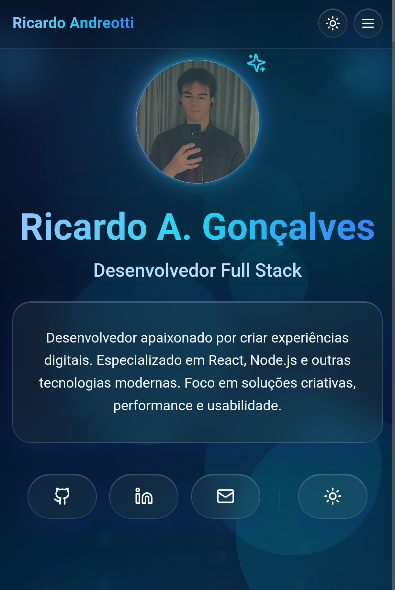
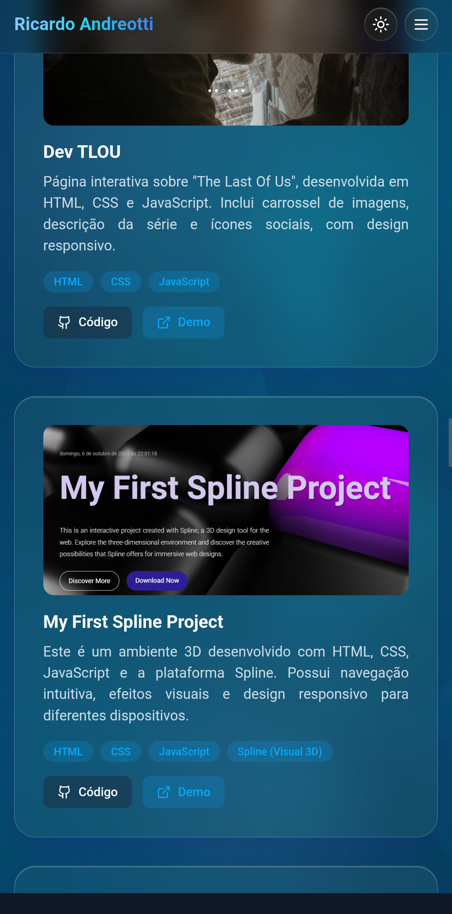
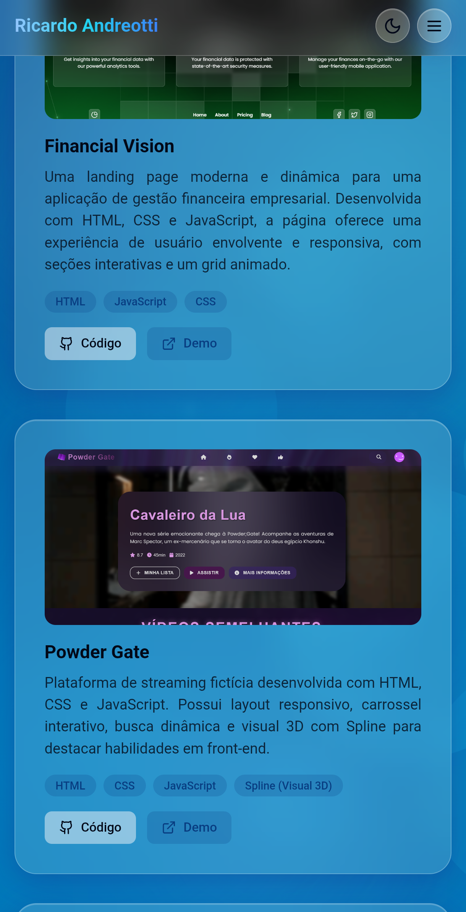

# ❄️ Frosted Motion Folio — Portfólio Interativo e Dinâmico!
<p align="center">
  
  
  
</p>

<p align="center">
  
</p>

## 📋 Sobre o Projeto
O **Frosted Motion Folio** é um portfólio pessoal moderno e interativo, desenvolvido para destacar projetos de forma fluida e responsiva.  
Com **efeito vidro fosco**, **animações suaves** e **tema claro/escuro**, o projeto oferece uma navegação elegante e intuitiva.  
Construído com **React**, **TypeScript**, **Tailwind CSS** e **Framer Motion**.

## ⚙️ Funcionalidades Principais
- 🎨 **Design Interativo**: Animações suaves e navegação fluida.
- 📂 **Seções Dedicadas**: Início, Sobre, Skills, Projetos e Contato.
- 🧩 **Apresentação de Projetos**: Cards com descrição, tecnologias e links.
- 📱 **Design Responsivo**: Compatível com todos os tamanhos de tela.
- ❄️ **Efeito Frosted Glass**: Visual elegante e moderno.
- 🌗 **Tema Claro/Escuro**: Alternância automática ou manual de tema.

<p align="center">
  
</p>

<p align="center">
  
</p>

## 🌐 Acesse o Projeto
👉 [**Frosted Motion Folio - Deploy no GitHub Pages**](https://devandreotti.github.io/frosted-motion-folio-v2/)

## 🛠 Tecnologias Utilizadas
- **[React](https://react.dev/)** — Biblioteca JavaScript para interfaces declarativas.
- **[TypeScript](https://www.typescriptlang.org/)** — Tipagem estática para maior robustez.
- **[Vite](https://vitejs.dev/)** — Build tool ultrarrápida para projetos modernos.
- **[Tailwind CSS](https://tailwindcss.com/)** — Estilização com classes utilitárias.
- **[Framer Motion](https://www.framer.com/motion/)** — Animações fluídas e declarativas.
- **[React Router DOM](https://reactrouter.com/en/main/start/tutorial)** — Gerenciamento de rotas no SPA.
- **[Lucide React](https://lucide.dev/guide/packages/lucide-react)** — Ícones SVG modernos e personalizáveis.

## 📂 Estrutura do Projeto
```
frosted-motion-folio-v2/
├── public/
│   └── img/
├── src/
│   ├── assets/
│   ├── components/
│   │   ├── About.tsx
│   │   ├── Contact.tsx
│   │   ├── Home.tsx
│   │   ├── Navbar.tsx
│   │   ├── Projects.tsx
│   │   ├── Skills.tsx
│   └── App.tsx
├── package.json
├── tsconfig.json
└── vite.config.ts
````

## 🚀 Como Rodar Localmente
1. **Clone o repositório:**

   ```bash
   git clone https://github.com/devAndreotti/frosted-motion-folio-v2.git
````

2. **Acesse a pasta do projeto:**

   ```bash
   cd frosted-motion-folio-v2
   ```

3. **Instale as dependências:**
   ```bash
   npm install
   # ou yarn
   # ou bun
   ```

4. **Inicie o servidor de desenvolvimento:**
   ```bash
   npm run dev
   # ou yarn dev
   # ou bun dev
   ```

## 🔮 Melhorias Futuras
* [ ] Adicionar novos projetos
* [ ] Melhorar performance e fluidez das animações
* [ ] Implementar suporte a múltiplos idiomas
* [ ] Adicionar testes automatizados

## 💪 Como Contribuir
1. Faça um fork do repositório
2. Crie uma branch: `git checkout -b feature/nova-feature`
3. Commit: `git commit -m "feat: nova feature"`
4. Push: `git push origin feature/nova-feature`
5. Abra um Pull Request 🎉

## 📝 Licença
Este projeto está sob a licença MIT.
Consulte o arquivo [LICENSE](https://github.com/devAndreotti/devAndreotti/blob/main/LICENSE) para mais detalhes.

---

<p align="center">
  Desenvolvido com ☕ por <a href="https://github.com/devAndreotti">Ricardo Andreotti Gonçalves</a> 🧑‍💻
</p>